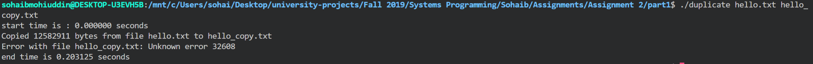
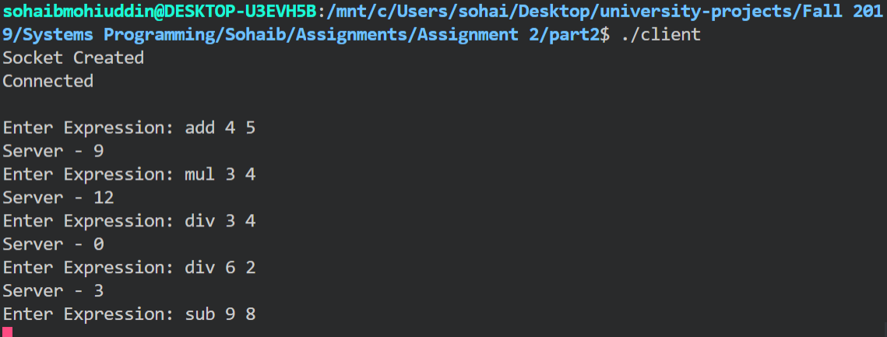

# Documentation
This documentation will go through the main steps of each program.
___

## Table of Contents
- [Duplicate](#duplicate.c)
  * [Screenshot of Output](#duplicate_output)
- [Server](#server.c)
- [Client](#client.c)
  * [Screenshot of Client-Server Output](#client_server_output)

<br><br><br><br><br><br><br><br><br><br><br><br><br><br><br><br><br><br><br><br><br><br><br><br><br><br><br><br><br><br><br><br>

## <a name="duplicate.c"></a>duplicate.c
This program is made to duplicate/copy files from one to another. This program is initialized by the command: 
<br>
**_./duplicate source_file target_file_**
<br> 
The source_file will be the file that you want content copied from, while the target_file will be the file that you want contant copied to.
<br><br>

This if statement checks the number of arguments when starting the program. This program can only be run with 3 arguments, no more and no less. The arguments as are such:
<br>
argv[1] = duplicate (Name of the program being run) <br>
argv[2] = source_file (Name and extension of the file you want content copied from) <br>
argv[3] = target_file (Name and extension of the file you want content copied to) <br>

```c
if (argc > 3) 
{
    printf("duplicate: too many arguments!\n");
    printf("Usage: ./duplicate <source_file> <target_file>\n");
    exit(1);
} 
else if (argc < 3) 
{
    printf("duplicate: too few arguments!\n");
    printf("Usage: ./duplicate <source_file> <target_file>\n");
    exit(1);
}
```

<br>
This is to assign the source file to the variable source with read permissions. The source file is obtained by the first argument and given only read permissions as the source file is only meant to be read and not edited: <br>

```c
source = fopen(argv[1], "r");

if (source == NULL)
{
    errnum = errno;
    fprintf(stderr, "Error opening file %s: %s\n", argv[1], strerror(errnum));
    exit(1);
}
```
<br>

This is to assign the target file to the variable target with write permissions. The target file is obtained by the second argument and given only write permissions as the target file is only meant to be written to: <br>

```c
target = fopen(argv[2], "w");

if (target == NULL)
{
    fclose(source);
    errnum = errno;
    fprintf(stderr, "Error opening file %s: %s\n", argv[2], strerror(errnum));
    exit(1);
}
```
<br>

This while loop that will iterate through the source file until the End Of File. This loop will take each character from the course file and save it to the variable ch, which will then be written to the target file with the function fputc. After putting the character from the source file into the target file, the following if statement checks the time, which was initialized at the beginning of the program, to see whether it has passed 1 second. If the timer has gone passed one second, the printf statement inside the if statement will print, else it will go to the next character:<br>

```c
while ((ch = fgetc(source)) != EOF)
{
    fputc(ch, target);

    if (((double) timer_running/CLOCKS_PER_SEC) > 1)
    {
        printf("duplicate: still duplicating...\n");
    }
}
```
<br>

Two methods were used to obtain the target file size, fseek() and ftell(). These two methods are used to find the exact size (in bytes) for the specified file, which in this case is the target file. This is so that we can see whether the exact number of bytes have been copied from the source file or not. The fseek() method takes 3 parameters: File, Start Point, End Point. The ftell() method takes 1 parameter: File, which is saved to the variable size (Integer initialized to 0 in the beginning):<br>

```c
fseek(target, 0, SEEK_END);
size = ftell(target);
if(size!=-1)
    printf("Copied %ld bytes from file %s to %s\n", size, argv[1], argv[2]);
else
    errnum = errno;
    fprintf(stderr, "Error with file %s: %s\n", argv[2], strerror( errnum ));
```
<br>

### <a name="duplicate_output"></a>Screenshot of duplicate.c Program


___
The following 2 programs work together as a client and server interaction. To run both programs properly, **server.c** is run first then **client.c** is run (A server must be running for a client to be able to connect, else the client has nothing to connect to and the program is terminated). These programs are designed to be a client and arithmetic server. The client takes user input and sends it to the server. The server will then parse through the string sent by the client and evaluate it. Once the expression (string) has evaluated, the result is sent back to the client.<br>

## <a name="server.c"></a>server.c
The server can be run by the following command: **_./server_**.
<br><br>

This code is to initialize a socket and assigning it to the variable socket_desc:<br>

```c
socket_desc = socket(AF_INET, SOCK_STREAM, 0);
if (socket_desc == -1)
{
    printf("could not create socket");
}
puts("Socket created");
```
<br>

This code is for setting up the connection address and connection port:<br>

```c
server.sin_family = AF_INET;
server.sin_addr.s_addr = INADDR_ANY;
server.sin_port = htons(8888);
```
<br>

Since this is the server, the server must listen for any incoming connections coming from any client that is trying to connect:<br>

```c
listen(socket_desc, 3);

puts("Waiting for incoming connections...");
```
<br>

Once a connection is being attempted by the client, the server must check to see whether the connection is valid or not. The accept() method is used to check the server socket, client socket and size of the incoming socket and it is assigned to the variable client_sock. If the connection is valid and the return value of client_sock is not less than 0, the connection is accepted:<br>

```c
c = sizeof(struct sockaddr_in);

client_sock = accept(socket_desc, (struct sockaddr *)&client, (socklen_t*)&c);
if (client_sock < 0)
{
    perror("Accept failed");
    return 1;
}
puts("Connection accepted");
```
<br>

Now that a connection has been made with the client, incoming/outgoing messages from/to the server can be made. We will first read the expression from the client. Once the client has written its expression and sent it to the server, the server will then evaluate the expression and send back a response with the result of the expression evaluation:<br>

```c
read(client_sock, &client_message, sizeof(client_message));
```
<br>

The following code will be segmented to explain each part of the while loop.<br><br>

The while loop is started with the condition that a message has been sent from the client and that the value is not less than 0:<br>

```c
while((read(client_sock, &client_message, sizeof(client_message))) > 0) 
    {
```
<br>

The following 3 while loops are to iterate through the client_message and save each part of the client_message in 3 seperate variables.<br><br>
This while loop iterates through the client_message till a space is reached, and each character read till the first space is saved to the variable "operation[4]" using the strncat() method, which holds "add/sub/div/mul"; add being addition, sub being subtraction, div being division, mul being multiplication. Once the space is reached, the while loop is exited and the variable "i" is incremented once more to pass the space and move to the next character in the client_message:<br>

```c
while(client_message[i]!= ' ')
{
    strncat(operation, &client_message[i], 1);
    i++;
}
i++;
```
<br>

This while loop iterates through the next set of characters in client_message till another space is reached, and each character read till the second space is saved to the variable "num1[30]" using the strncat() method, which is meant to hold an integer (i.e. 1, 5, 200, 3, ...). Once the second space is reached, the while loop is exited and the variable "i" is incremented once more to pass the space and move to the next character in the client_message. After the while loop, sscanf() is used to save the characters in "num1[30]" to an integer "n1"::<br>

```c
while(client_message[i]!= ' ')
{
    strncat( num1, &client_message[i], 1);
    i++;
}
i++;

sscanf(num1, "%d", &n1);
```
<br>

This while loop iterates thorugh the final set of characters in client_message till the end of the client_message, and each character read till the end of the string is saved to the variable "num2[30]" using the strncat() method, which is meant to hold an integer (i.e. 1, 5, 200, 3, ...). Once the end of the string is reached, the while loop is exited. After the while loop, sscanf() is used to save the characters in "num2[30]" to an integer "n2":<br>

```c
while(client_message[i]!= ' ')
{
    strncat( num2, &client_message[i], 1);
    i++;
}

sscanf(num2, "%d", &n2);
```
<br>

This if statement then compares the characters in "operation[4]" to "add/sub/div/mul" using the strcmp() method which compares two strings. Once the string in "operation[4] is identified, the appropriate result is evaluated. Once the result is evaluated, the "result" is formatted from an integer into a set of characters and saved to "sum[30]" and written back to the client. Once the program leaves the if statement, the character arrays are all emptied back to null:<br>

```c
if (!strcmp(operation, "add"))
{
    result = n1 + n2;

    sprintf(sum, "%d\n", result);

    n = write(client_sock, &sum, strlen(sum));
    if (n < 0)
        perror("Error writing to the socket");
}
else if (!strcmp(operation, "sub"))
{
    result = n1 - n2;

    sprintf(sum, "%d\n", result);

    n = write(client_sock, &sum, strlen(sum));
    if (n < 0)
        perror("Error writing to the socket");
}
else if (!strcmp(operation, "div"))
{
    if (n2 == 0)
    {
        n = write(client_sock, "Cannot divide by 0, try again.", strlen("Cannot divide by 0, try again."));
        if (n < 0)
            perror("Error writing to the socket");
    }
    result = n1 / n2;

    sprintf(sum, "%d\n", result);

    n = write(client_sock, &sum, strlen(sum));
    if (n < 0)
        perror("Error writing to the socket");
}
else if (!strcmp(operation, "mul"))
{
    result = n1 * n2;

    sprintf(sum, "%d\n", result);

    n = write(client_sock, &sum, strlen(sum));
    if (n < 0)
        perror("Error writing to the socket");
}
memset(operation, 0, 4);
memset(num1, 0, 30);
memset(num2, 0, 30);
memset(sum, 0, 5);
memset(client_message, 0, 2000);
fflush(stdin);
fflush(stdout);
```
<br>

## <a name="client.c"></a>client.c
The client can be run with the following command: **_./client_**.
<br><br>

This code is to initialize a socket and assigning it to the variable sock:<br>

```c
sock = socket(AF_INET, SOCK_STREAM, 0);
if (sock == -1) 
{
    printf("Could not create socket");
}
puts("Socket Created");
```
<br>

This code is for setting up the conection address and connection port:<br>

```c
server.sin_addr.s_addr = inet_addr("127.0.0.1");
server.sin_family = AF_INET;
server.sin_port = htons(8888);
```
<br>

This while loop will write an expression to the server, and that string will be saved to the variable "message[1000]". The fgets() method is used to take user input and it saves the user input to the variable "message[1000]". "message[1000]" (which should contain the expression needed by the server in the format "operation num1 num2") is then written to the server. The server then evaluates the expression and sends the result back to the client, which is saved to the variable "buffer[1024]". At the end of the while loop, the character arrays are emptied back to null:<br>

```c
while(1)
{
    printf("Enter Expression: ");
    fgets(message, 1000, stdin);

    write(sock, &message, sizeof(message));

    if (send(sock, message, strlen(message), 0) < 0)
    {
        puts("Send failed");
        return 1;
    }

    n = read(sock, buffer, 255);
    if (n < 0)
        perror("Error reading from socket");
    
    printf("Server - %s", buffer);

    memset(buffer, 0, 1024);
    memset(message, 0, 1000);
    memset(server_reply, 0, 2000);
    fflush(stdin);
    fflush(stdout);
}
```
<br>

### <a name="client_server_output"></a>Screenshot of client.c & server.c Program Output

